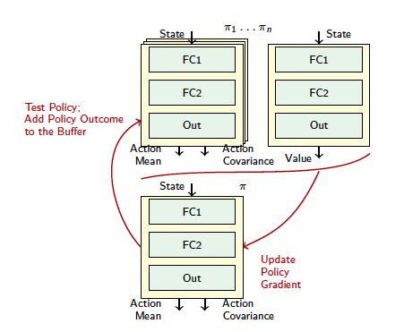

# TRPO-REPLAY
The implementation is based on the OpenAI baselines library and ACKTR implementation in particular. 
Original paper: https://arxiv.org/abs/1901.06212

Dmitry Kangin, Nicolas Pugeault (2018) On-Policy Trust Region Policy Optimisation with Replay Buffers, arXiv:1901.06212

## Description

Building upon the recent success of deep reinforcement learning methods, we investigate the possibility of on-policy reinforcement learning improvement by reusing the data from several consecutive policies. On-policy methods bring many benefits, such as ability to evaluate each resulting policy. However, they usually discard all the information about the policies which existed before. In this work, we propose adaptation of the replay buffer concept, borrowed from the off-policy learning setting, to create the method, combining advantages of on- and off-policy learning. To achieve this, the proposed algorithm generalises the Q-, value and advantage functions for data from multiple policies. The method uses trust region optimisation, while avoiding some of the common problems of the algorithms such as TRPO or ACKTR: it uses hyperparameters to replace the trust region selection heuristics, as well as  the trainable covariance matrix instead of the fixed one. In many cases, the method not only improves the results comparing to the state-of-the-art trust region on-policy learning algorithms such as PPO, ACKTR and TRPO, but also with respect to their off-policy counterpart DDPG.  


The proposed approach derives gradient based on several subsequent policies instead of one policy used by previously known trust region based methods thus reusing previously collected data. 
<p align="center">
  
</p>


## Requirements
 OpenAI baselines library (see README.md in the root directory of this repository for details)
## Usage
To launch the experiments, use the following command: ```LD_LIBRARY_PATH=$HOME/.mujoco/mjpro150/bin DISABLE_MUJOCO_RENDERING=True python3 launch_test.py```

The test environment ids must be listed in launch_test.py as follows: ```env_ids = {'Ant-v2'}```
```NUM_FOLDS``` specifies the number of repetitive experiments for the same environment
The experiment results are logged in the subdirectory named according to the following pattern:  ```logs_{ENVIRONMENT_ID}_{FOLD_INDEX}```, so that ```logs_Ant-v2_0``` means that this is the folder with logs for the environment Ant-v2, fold index is 0. 

## Results visualisation
The original visualiser, used for the paper, is located in ../customised_plotter.py . It outputs the file for every task in the listed directory.  
Parameters of visualiser, including the listed directories and the names of the algorithms, are set in the main function of the file. The file is used as : python3 customised_plotter.py

